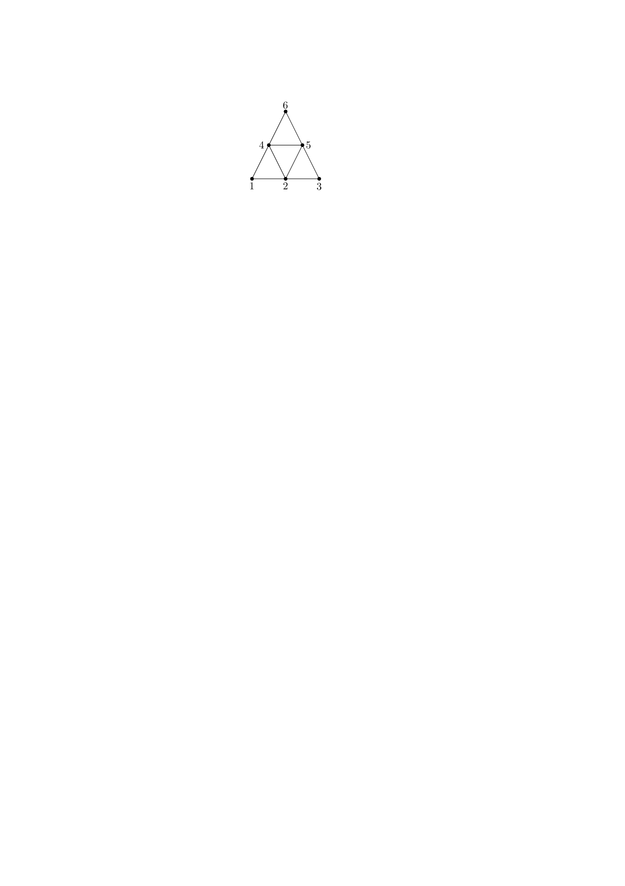
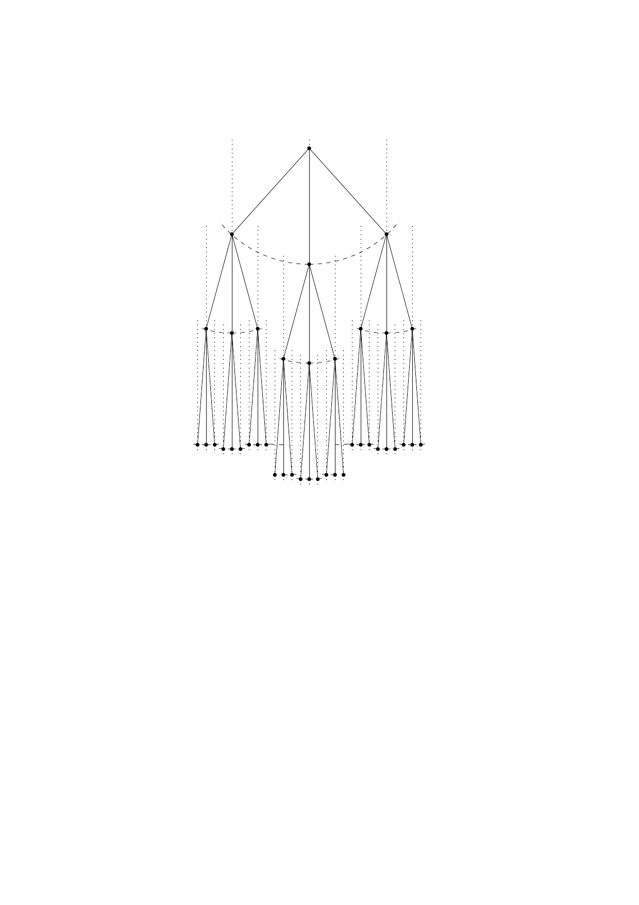
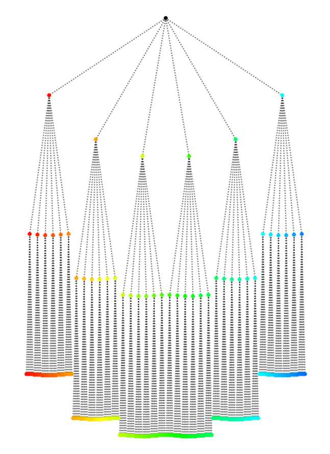
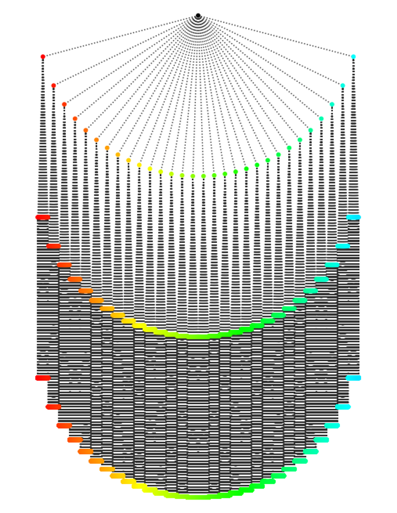
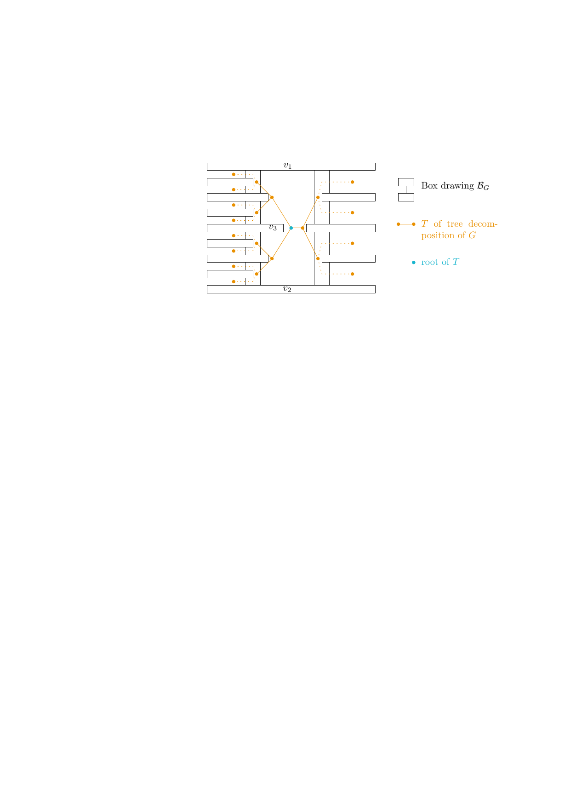
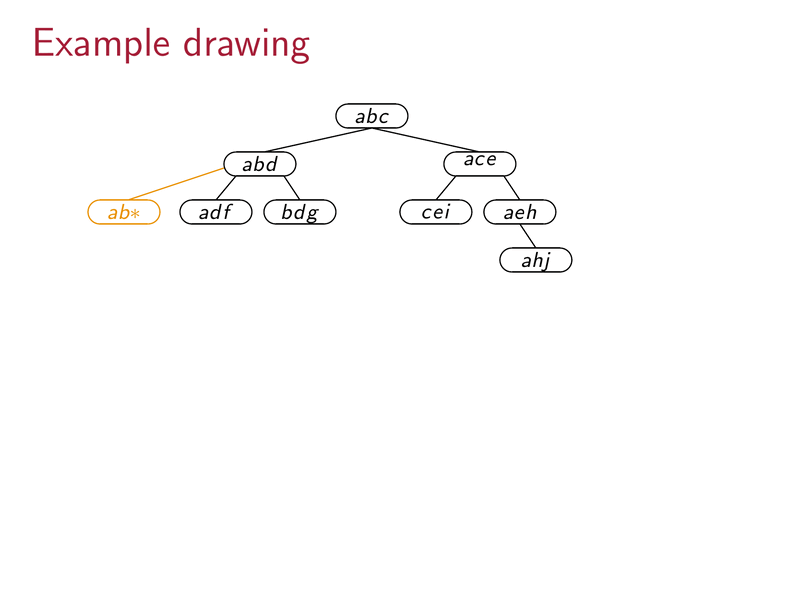
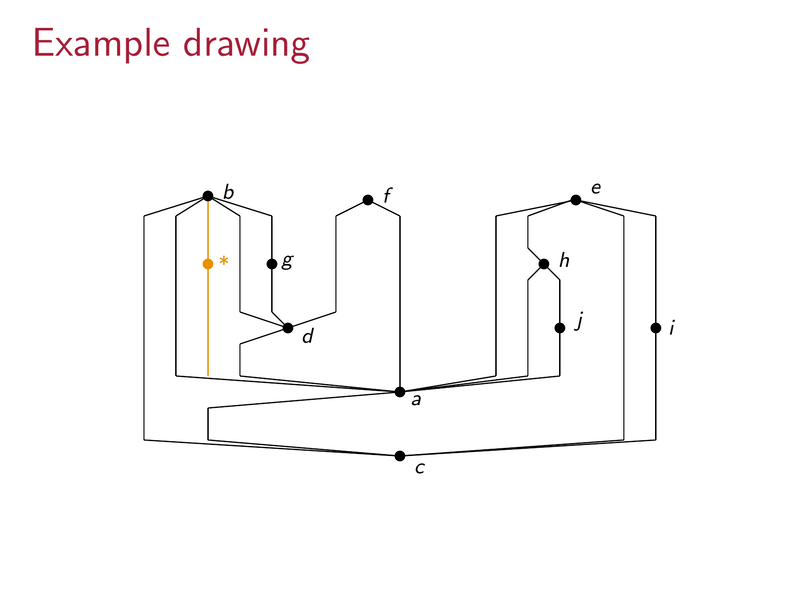

# On Maximizing the Euclidean Distance Between Adjacent Vertices in Drawings of Small Area

**Author:** Cobbie Coban  
**Thesis:** Master of Science in Computer Science  
**Conference context:** GD 2022 Live Challenge

---

## Abstract

This thesis studies a graph drawing problem posed at the Graph Drawing 2022 Live Challenge: given a planar graph, produce a drawing on a small integer grid that **maximizes the minimum Euclidean distance between any pair of adjacent vertices**. The core difficulty is the tension between keeping the grid area small and keeping vertices well-separated.

The quality of a drawing is measured by the **ratio**:

```
ratio = (length of longest polyline edge) / (minimum Euclidean distance between adjacent vertices)
```

A ratio close to 1 is ideal; a larger ratio means some edges are much longer than the closest pair of neighbors, indicating an unbalanced drawing.

Both **straight-line** and **polyline** drawings (with bends) are considered. For polyline drawings the number of bends per edge is also tracked.

---

## Graph Classes

The thesis develops and analyzes algorithms for four graph classes, in increasing order of difficulty:

| Graph class | Drawing type | Ratio | Grid area | Bends/edge |
|---|---|---|---|---|
| Rooted *k*-ary trees | Straight-line | 1+ε | O(n² log n) | 0 |
| General trees | Straight-line | 1+ε | Exponential | 0 |
| Maximal outerplanar graphs | Polyline | O(log² n) | O(n² log² n) | 2 |
| Maximal SP-graphs (2-trees) | Polyline | O(log² n) | O(n² log² n) | ≤ 2 |
| Planar 3-trees | — | Open | — | — |

> The SP-graph approach does not generalize to planar 3-trees; this remains an open problem.

---

## Drawing Models

Both straight-line and polyline drawings are considered. A straight-line drawing maps every edge to a single segment between its endpoints. A polyline drawing allows bends along edges, which gives more flexibility to route edges and improve the minimum adjacent-vertex distance.



---

## Rooted *k*-ary Trees

The algorithm draws a rooted *k*-ary tree by recursively partitioning the grid and placing children of each node on a row directly below their parent, spaced at uniform horizontal intervals determined by the subtree widths.

The key insight is that a careful partitioning scheme keeps edge lengths nearly equal across the entire drawing, yielding a ratio close to 1 and total area O(n² log n).



### Python Implementation

A Python implementation of the *k*-ary tree drawing algorithm is available in a separate repository:

**[CobbieCobbie/k-ary_tree_drawer](https://github.com/CobbieCobbie/k-ary_tree_drawer)**

Built with `networkx` and `matplotlib`, it takes `-k` (branching factor) and `-he` (height) as arguments and produces a straight-line drawing on a grid where all edges have uniform length (up to rounding). The `-c` flag colors the levels and `-i` opens an interactive plot.

```bash
pip install -r requirements.txt
python ./k-ary_tree_drawer.py -k 3 -he 4 -c -i
```

| 6-ary tree, height 3 | 30-ary tree, height 3 |
|---|---|
|  |  |

---

## Maximal Outerplanar Graphs

A maximal outerplanar graph is a triangulation of a convex polygon — all vertices lie on the outer face and every interior face is a triangle. A naive extension of the tree approach (Approach I) yields a polyline drawing whose ratio is unbounded in the worst case. A second approach based on a tree decomposition of the outerplanar graph (Approach II) achieves a ratio of **O(log² n)** with grid area **O(n² log² n)** and at most **2 bends per edge**.



---

## Maximal SP-Graphs (Series-Parallel / 2-Trees)

A maximal series-parallel graph (2-tree) is defined recursively: start from a single edge, and repeatedly add a new vertex adjacent to both endpoints of an existing edge. These graphs have a hierarchical structure captured by their **SPQR tree**, which drives the drawing algorithm.

### Algorithm

1. Decompose the SP-graph via its SPQR tree.
2. Process the SPQR tree bottom-up, assigning each node a **slot** — a rectangular region of the grid.
3. Merge child slots into parent slots, routing the two edges of each new triangle as polylines with at most 2 bends each.
4. Scale and translate the assembled drawing to fit on the final grid.

The result is a polyline drawing with **ratio O(log² n)**, grid area **O(n² log² n)**, and **at most 2 bends per edge**.

### Step-by-step Example

The animation below shows the algorithm processing a small SP-graph. The top panel highlights the current SPQR tree node (in pink); the bottom panel shows the drawing being assembled node by node, ending with the complete polyline drawing.





---

## Planar 3-Trees

A planar 3-tree is built by starting from a triangle and repeatedly inserting a vertex inside a triangular face, connecting it to all three face vertices. The SP-graph approach does not extend to this class; the additional connectivity creates conflicts in the slot-merging step. This remains an **open problem**.

---

## Repository Structure

```
.
├── MSc-Coban_OnMaximizingTheEuclidianDistanceBetweenAdjacentVerticesInDrawingOfSmallArea.pdf
│                          — full thesis PDF
├── MSc_Presentation_final.pdf
│                          — conference presentation slides
├── figures/               — figures used in this README
├── report/                — LaTeX source (master_thesis.tex, ref.bib, graphics/)
└── thesis-report.isy      — Texmaker/TeXstudio project file
```

---

## References

- Full thesis: [MSc-Coban_OnMaximizingTheEuclidianDistanceBetweenAdjacentVerticesInDrawingOfSmallArea.pdf](MSc-Coban_OnMaximizingTheEuclidianDistanceBetweenAdjacentVerticesInDrawingOfSmallArea.pdf)
- Presentation: [MSc_Presentation_final.pdf](MSc_Presentation_final.pdf)
- *k*-ary tree implementation: [CobbieCobbie/k-ary_tree_drawer](https://github.com/CobbieCobbie/k-ary_tree_drawer)
